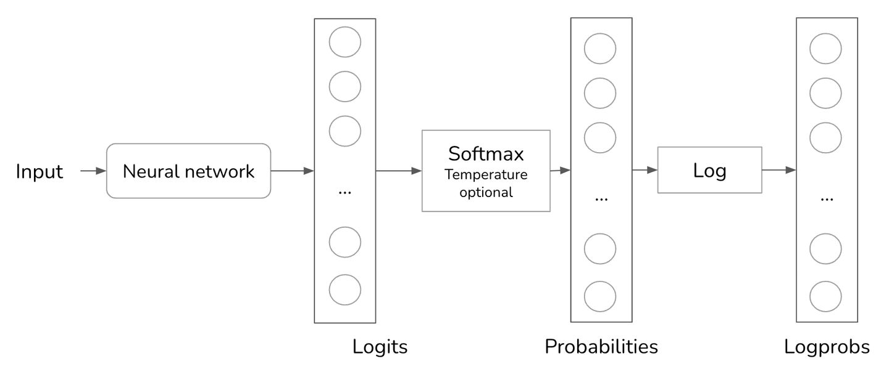

---
html:
    toc: true
    # number_sections: true
    toc_depth: 6
    toc_float: true
    collapsed: true
    smooth_scroll: true
---

<!-- @import "[TOC]" {cmd="toc" depthFrom=1 depthTo=6 orderedList=false} -->

<!-- code_chunk_output -->

- [文本采样（解码）](#文本采样解码)
  - [采样](#采样)
  - [一、Greedy Search（局部最优的贪心搜索方法）](#一-greedy-search局部最优的贪心搜索方法)
  - [二、Beam Search](#二-beam-search)
  - [三、Temperature Sampling（温度）](#三-temperature-sampling温度)
  - [四、Top-K Sampling](#四-top-k-sampling)
  - [五、Top-P Sampling](#五-top-p-sampling)
  - [六、实例](#六-实例)
  - [七、联合采样（top-k & top-p & Temperature）](#七-联合采样top-k--top-p--temperature)
  - [八、停止条件](#八-停止条件)

<!-- /code_chunk_output -->


# 文本采样（解码）

在**自然语言生成**（Natural Language Generation, NLG）任务中，训练完成之后，通常需要根据已有的输入 tokens 序列来预测下一个 token 在词表（vocabulary）上的**条件概率分布**，再从条件概率分布中**搜索**或**采样**出下一个 token。生成的 token 作为输入序列的一部分，进入到模型中，最终生成所需要的完整句子。

文本生成任务中，采样方法的选择决定了生成文本的质量。常用的采样方法包括：
- Greedy Search
- Beam Search
- Temperature Sampling
- Top-k Sampling
- Top-p Sampling
  
## 采样
为了生成下一个token，语言模型首先计算词汇表中所有token的概率分布。对于语言模型来说，总是选择最可能的下一个token，即**贪婪采样**（Greedy Search），会导致输出乏味。想象一下，一个模型不管你问什么问题,它总是用最常见的词来回答。

通过采样的方法，可以增加文成生成过程中的**随机性**。采样是根据概率分布情况，来随机生成下一个单词（根据所有可能值的概率分布来采样下一个token,而不是总是选择最可能的下一个token）。例如，已知单词 [a, b, c] 的生成概率分别是 [0.1, 0.3, 0.6]，则接下来生成 c 的概率就会比较大，生成 a 的概率就会比较小。

给定一个输入，神经网络处理这个输入并输出一个logit向量。在语言模型中，每个logit对应模型词汇表中的一个token。logit向量的大小就是词汇表的大小。虽然较大的logit对应较高的概率，但logit本身并不代表概率（Logit不会加起来等于1）。为了将logit转换为概率，通常使用softmax层。假设模型有一个大小为N的词汇表,logit向量为[x1,x2,...,xN]。第i个token的概率pi计算如下:
$$p_i=softmax(x_i)=\frac{e^{x_i}}{\sum_je^{x_j}}$$

<center class='img'>
    
    <div style="padding: 2px;">
        根据token概率采样下一个token
    </div>
</center>
<br/>
在使用AI模型时，一个常见的调试技术是查看该模型针对给定输入计算的概率。例如，如果概率看起来是随机的,说明模型没有学到太多。OpenAI返回他们模型生成的概率作为logprobs。Logprobs是**对数概率**的简称，是**对数尺度上的概率**。在处理神经网络的概率时，更倾向于使用对数尺度，因为它有助于减少**下溢问题**。语言模型的词汇量可能达到10万，这意味着许多token的概率可能太小，无法由机器表示。小数字可能被四舍五入为0。对数刻度有助于减少这个问题。
<center class='img'>
    
    <div style="padding: 2px;">
        使用logprob根据token概率采样下一个token
    </div>
</center>

## 一、Greedy Search（局部最优的贪心搜索方法）
每一步都选择概率最大的 token 进行输出，最后组成整个句子。
**优点**：计算速度快，方法简单。

**缺点**：局部最优并不等于全局最优，某一步选错，后续生成的可能也都是错的。

**代码实现**：选取条件概率分布最大的 token 作为输出，即取 argmax() 。参考 [《Transformer 从零开始（二）》](https://zhuanlan.zhihu.com/p/451182425)和[《文本摘要（五）：seq2seq 训练及预测》](https://zhuanlan.zhihu.com/p/452703432) 两篇文章中的模型的预测代码。
```
import numpy as np

def greedy_search(prob):
    return np.argmax(prob)
```

## 二、Beam Search
Beam Search 在每个时间步保留 beam size 个最大的可能取值路径。假设词典大小为 v，beam size 为 k，则**每个时间步生成的候选路径有 $k∗v$个**，**保留其中概率最大的 k 个路径**，再进入下一个时间步的搜索中。

当k=1时，Beam Search 退化为 Greedy Search。
<center class='img'>
    
    <div style="padding: 2px;">
        Beam Search
    </div>
</center>
<br/>

**优点**：平衡了 Greedy Search 和暴力穷举搜索，在时间复杂度和模型最优解之间取平衡。

**缺点**：由每一步比较的概率是路径上每个时间步概率的乘积，因此 Beam Search 倾向于生成较短的句子。利用 Greedy Search 或 Beam Search 都是根据概率最大化的原则生成文本，相比人正常对话的句子，这些生成的文本没有多样性和意外性。

**代码实现**：
```
def beam_search(probs, k):
    seq_scores = [[list(), 0]]
    for prob in probs:
        candidates = list()
        for seq, score in seq_scores:
            for j in range(len(prob)):
                candidates.append([seq + [j], score - np.log(prob[j])])
        seq_scores = sorted(candidates, key=lambda x: x[1])[:k]
    return seq_scores
```

## 三、Temperature Sampling（温度）
**问题1**：但如果按照全体词的概率分布来进行采样，还是有可能生成低概率的单词，导致生成的句子出现语法或语义错误。通过在 softmax 函数中加入 Temperature （温度）参数，强化顶部词的生成概率，在一定程度上可以解决这一问题。

**问题2**：根据概率分布采样下一个token的一个问题是,模型可能没那么有创意。在之前的例子中,表示颜色的常见词如"red"、"green"、"purple"等的概率最高。语言模型的回答最终听起来像是一个五岁小孩的回答:"My favorite color is green。"因为冠词"the"的概率较低，模型生成一个有创意的句子如"My favorite color is the color of a still lake on a spring morning"的可能性就很小。

**温度是一种用于重新分配可能值概率的技术**。温度是一个常数,用于在softmax变换之前调整logit。Logit除以温度。对于给定的温度$T$，第$i$个token的调整后logit为$\frac {x_i}{T}$。Softmax应用在这个调整后的logit上,而不是在$x_i$上。
$$
 p(i) = \frac {e^{\frac {x_i}{T}}} {\Sigma_{j=1}^K e^{\frac {x_j}{T}}}
$$
 在上述公式中，当$T<1$时，将会增加顶部词的生成概率，且$T$越小，越倾向于 Greedy Search 的方法生成下一个词；$T>1$时，将会增加底部词的生成概率（模型选择logit最高的值的可能性就越小,使得模型的输出更有创意，但可能性减弱），且$T$越大，越倾向于从均匀分布中生成下一个词。

<center class='img'>
    
    <div style="padding: 2px;">
        T值选择对概率分布的影响(模拟每个字母生成的概率)
    </div>
</center>
<br/>

**优点**：生成的文本具有多样性和随机性。

**缺点**：$T$值的选择需要依赖于经验或调参。

**代码实现**：
```
def temperature_sampling(prob, T=0.2):
    def softmax(z):
        return np.exp(z) / sum(np.exp(z))
    log_prob = np.log(prob)
    reweighted_prob = softmax(log_prob / T)
    sample_space = list(range(len(prob)))
    original_sample = np.random.choice(sample_space, p=prob)
    temperature_sample = np.random.choice(list(range(len(prob))), p=reweighted_prob)
    return temperature_sample
```

## 四、Top-K Sampling
**问题1**：在 Temperature Sampling 的过程中，即便选取了合适的$T$值，还是会有较低的可能性生成低概率的单词。

应用 Top-K 可以根据概率分布情况，预先挑选出概率最高的 K 个单词，然后重新根据 softmax 计算这 K 个单词的概率，再根据概率分布情况进行采样，生成下一个单词。采样还可以选用 Temperature Sampling 方法。

**问题2**：为了计算所有可能值的概率分布，使用了softmax层。Softmax需要对所有可能的值进行两次遍历：一次是执行指数和$\sum_je^{x_j}$，另一次是对每个值执行$\frac{e^{x_i}}{\sum_je^{x_j}}$。对于具有大词汇量的语言模型，这个过程在计算上是昂贵的。

为了避免这个问题，在模型计算出logit后，我们选择前k个logit，只对这些前k个logit执行softmax。根据你希望你的应用程序有多大的多样性，k可以是50到500之间的任何值，远小于模型的词汇量。然后，该模型从这些顶值中进行采样。较小的k值会使文本更加可预测，但不那么有趣，因为模型被限制在一个较小的可能词集合中。

**优点**：可以避免低概率词的生成，减少成本。

**缺点**：K值的选择需要依赖于经验或调参。比如，在较为狭窄的分布中，选取较小的K值；在较为宽广的分布中，选取较大的K值。

**代码实现**：
```
def top_k(prob, k=5):
    def softmax(z):
        return np.exp(z) / sum(np.exp(z))

    topk = sorted([(p, i) for i, p in enumerate(prob)], reverse=True)[:k]
    k_prob = [p for p, i in topk]
    k_prob = softmax(np.log(k_prob))
    k_idx = [i for p, i in topk]
    return k_idx, k_prob, np.random.choice(k_idx, p=k_prob)
```

## 五、Top-P Sampling
Top-P Sampling (Nucleus sampling) 是预先设置一个概率界限 p 值，然后将所有可能取到的单词，根据概率大小从高到低排列，依次选取单词。当单词的累积概率大于或等于 p 值时停止，然后从已经选取的单词中进行采样，生成下一个单词。采样同样可以选用 Temperature Sampling 方法。在语言模型中,top-p(nucleus)采样的常见值通常在0.9到0.95之间。例如,top-p值为0.9意味着模型将考虑累积概率超过90%的最小值集合。

假设所有token的概率如下图所示。如果top_p=90%,只有yes和maybe会被考虑,因为它们的累积概率大于90%。如果top_p=99%,那么yes、maybe和no都会被考虑。
<center class='img'>
    
    <div style="padding: 2px;">
        使用top-p根据token概率采样下一个token
    </div>
</center>
<br/>

**优点**：可以避免低概率词的生成。

**缺点**：同样，P值的选择需要依赖于经验或调参。

**代码实现**：
```
from itertools import accumulate
from bisect import bisect

def top_p(prob, p=0.9):
    def softmax(z):
        return np.exp(z) / sum(np.exp(z))

    sorted_prob = sorted([(p, i) for i, p in enumerate(prob)], reverse=True)
    sorted_p = [p for p, i in sorted_prob]
    sorted_idx = [i for p, i in sorted_prob]
    acc_p = list(accumulate(sorted_p))
    k = bisect(acc_p, p)
    reweighted_p = softmax(np.log(sorted_p[:k]))
    return sorted_idx[:k], reweighted_p, np.random.choice(sorted_idx[:k], p=reweighted_p)
```

## 六、实例
在一段模拟数据上，看一下 Top-K 和 Top-K 选取不同参数情况下，生成的单词的概率分布。实际上，k 值和p 值的选择对文本生成结果的影响是巨大的。在实际应用中，Top-P、Top-K 以及 Temperature Sampling 可以结合起来使用，从而使得生成的文本更加符合合理。
```
ks = [5, 10, 15]
plt.figure(figsize=(15, 8))
for i, k in enumerate(ks):
    k_idx, k_prob, _ = top_k(prob, k=k)
    plt.subplot(2, 3, i+1)
    plt.bar([dictionary[i] for i in k_idx], k_prob)
    plt.title(f'Top-K, k={k}')

ps = [0.5, 0.7, 0.9]
for i, p in enumerate(ps):
    p_idx, p_prob, _ = top_p(prob, p=p)
    plt.subplot(2, 3, i+4)
    plt.bar([dictionary[i] for i in p_idx], p_prob)
    plt.title(f'Top-P, p={p}')

plt.show()
```
<center class='img'>
    
    <div style="padding: 2px;">
        Top-K 和 Top-P 参数比较
    </div>
</center>

## 七、联合采样（top-k & top-p & Temperature）
通常我们是将 top-k、top-p、Temperature 联合起来使用。使用的先后顺序是 top-k->top-p->Temperature

## 八、停止条件
自回归语言模型通过逐个生成词元来生成词元序列。较长的输出序列需要更多时间和计算资源（金钱），有时会让用户感到厌烦。因此，我们可能需要为模型设置一个停止生成序列的条件。
有两种简单的方法可以停止生成序列。第一种方法是在生成固定数量的词元后要求模型停止，这种方法的缺点是输出很可能会在句子中途被截断。另一种方法是使用停止词元（stop token），例如，可以要求模型在遇到"<EOS>"时停止生成。停止条件有助于降低时延和成本。